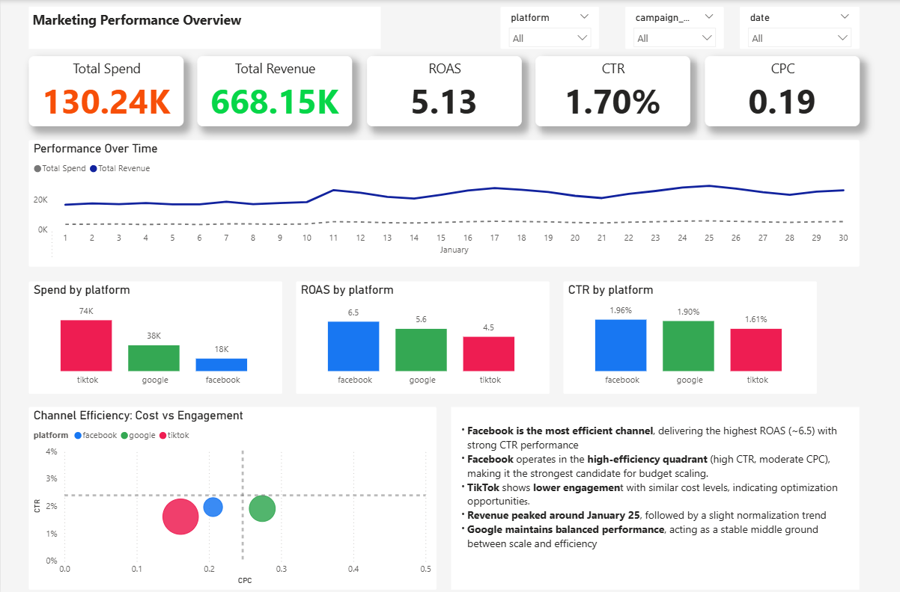

# 📊 Multi-Channel Marketing Performance Analysis

## 🧠 Business Context

Marketing teams often run campaigns across multiple platforms, but performance data is fragmented. This project simulates a real-world scenario where a data analyst must unify and analyze cross-channel advertising data to support decision-making.

---

## 🎯 Objective

Build a unified data model combining Facebook Ads, Google Ads, and TikTok data, and create a dashboard to evaluate cross-channel performance and identify optimization opportunities.

---

## 📂 Data Sources

* Facebook Ads performance data
* Google Ads campaign data
* TikTok engagement metrics

Each dataset contains daily campaign-level metrics such as impressions, clicks, spend, and conversions.

---

## 🛠️ Data Preparation

Data was transformed and standardized using **Power Query**:

* Column names unified across platforms
* Data types cleaned and normalized
* Added a `platform` field to identify source
* Appended all datasets into a single table

### Data Model Logic (SQL representation)

```sql
SELECT date, campaign_name, 'Facebook' as platform, impressions, clicks, spend, conversions
FROM facebook_ads

UNION ALL

SELECT date, campaign_name, 'Google' as platform, impressions, clicks, spend, conversions
FROM google_ads

UNION ALL

SELECT date, campaign_name, 'TikTok' as platform, impressions, clicks, spend, conversions
FROM tiktok_ads;
```

---

## 📊 Dashboard Overview


The dashboard provides a one-page overview of marketing performance across all channels.

---

## 📈 Key Metrics

* **CTR (Click-Through Rate)** → engagement efficiency
* **CPC (Cost per Click)** → traffic cost efficiency
* **CPA (Cost per Acquisition)** → conversion cost
* **Total Spend** → investment level
* **Total Conversions** → campaign effectiveness

---

## 🔍 Key Insights

* **Google Ads** shows the highest conversion efficiency (lower CPA)
* **TikTok** generates strong engagement (high CTR) but lower conversion rates
* **Facebook Ads** maintains stable, balanced performance across metrics

---

## 💡 Business Recommendations

* Reallocate budget toward high-performing Google campaigns to maximize ROI
* Optimize TikTok landing pages or targeting to improve conversion rates
* Maintain Facebook as a stable channel for consistent performance

---

## 🧰 Tools & Technologies

* **Power BI** → dashboard & visualization
* **Power Query** → data transformation
* **SQL** → data modeling logic

---

## 📁 Repository Structure

```
├── data/          # Raw datasets
├── dashboard/     # Power BI file (.pbix)
├── images/        # Dashboard screenshots
├── sql/           # Data model query
└── README.md
```

---

## ▶️ How to Use

1. Download the `.pbix` file from the `marketing-multi-channel-analysis` folder
2. Open it using Power BI Desktop
3. Refresh data if needed

---

## 🚀 What This Project Demonstrates

* Ability to clean and unify multi-source data
* Understanding of marketing performance metrics
* Data modeling and transformation skills
* Translating data into actionable business insights

---

## 📬 Contact

If you’d like to discuss this project or opportunities in data analytics, feel free to connect on LinkedIn.
